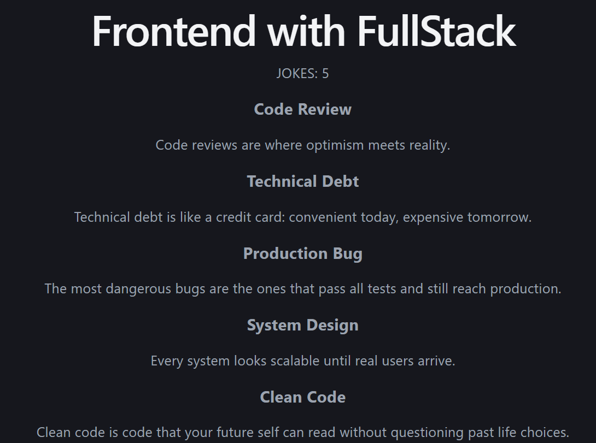

# MiniFullStackProject

## FullStackJokesApp

A simple Full Stack application built using React, Express.js, and Axios.
The backend serves a collection of programming jokes through a REST API, and the frontend fetches and displays them dynamically.

-----------------------------------------------------------------------

## Features 🚀
- Fetch jokes from Express backend
- Display jokes dynamically in React
- REST API integration using Axios
- Beginner-friendly full stack project
- Clean and simple UI

-----------------------------------------------------------------------

## HomePageImage

-----------------------------------------------------------------------

## Tech Stack 🛠️

### Frontend
- React
- Axios
- Vite

### Backend
- Node.js
- Express.js

-----------------------------------------------------------------------

## What I Learned 📚
- Creating APIs using Express.js
- Sending JSON responses from backend
- Fetching API data using Axios
- React Hooks (useState & useEffect)
- Connecting frontend and backend applications

-----------------------------------------------------------------------

## Author 👩‍💻
Nandini Verma

"First Full Stack project built independently using React and Express.js."

